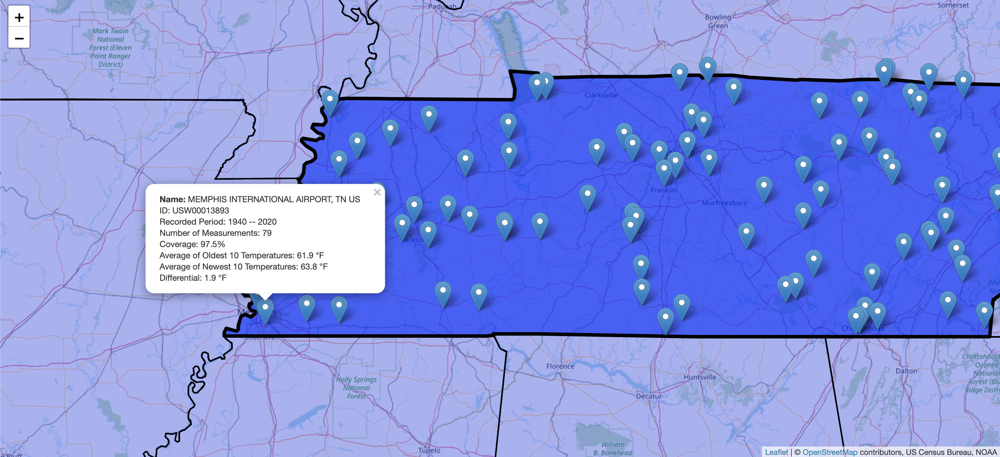

## Inspiration

Climate change and its associated effects are likely the most pressing issues facing our world. Though its effects seem far off, its immediate and existing impacts are already measureable and potentially catastrophic. We built **Climate Display** to help illustrate to viewers the real effects of climate change at a scale relatable to the viewer.

## What it does

Climate Display allows users to explore local trends in temperature from stations near them. On our interactive leaflet map, the useris able to choose their home state and scroll in towards thier home. From there, they can view summaries of data collected from various stations, and see the measureable increases in temperature that have occured near their home.

## How we built it

We built the map for Climate Display using Leaflet.js. When the user clicks their home state and scrolls to a high enough zoom level, we call a NOAA api which then returns a list of weather stations. We are then able to match each of these weather stations to their location, allowing us to add them as markers to the graph. Once the user clicks on a marker, a different NOAA api si called to return the data collected by that station over the past 100 years.

The visualizations for global trends were either created using Google sheets or gathered from the internet.

## Challenges we ran into

At the start, we also had downloaded a list of NOAA stations and their locations. We thought that we could then query for data from each of these stations, but it turned out that many of these stations had none of the measurements that we sought. The NOAA data itself is sometimes inconsistent, where requesting stations within a certain bounding box does not always return the same results.

## Accomplishments that we're proud of

Managing to complete this project. This was our first hackathon and neither of us had significant computer science experience. We didn't know exactly how much work to expect, or how we would balance it with our school work. It was a fun experience, and we hope to do it again.

## What we learned

Through this project we learned quite a bit about Leaflet.

## What's next for Climate Display

To deal with inconsistencies in NOAA data, we would like to download the raw datasets that the api queries and preprocess them on our end, so that we leave only the stations with a high degree of coverage over a lengthy period. This would also allow us to know the temperature change represented by each, possibly allowing us to color code our markers.

Additionally, the NOAA data gives us access to various other metrics, such as precipitation and days above 90 degrees. Global warming has been associated with an increase in days regarded as “very hot,” and thus this could possibly help us illustrate more of its effects.

We would have also liked to have the chance to add additional toggleable layers to our map, such as for wildfires, and to have developed additional maps to better illustrate the effects of sea level rise.
